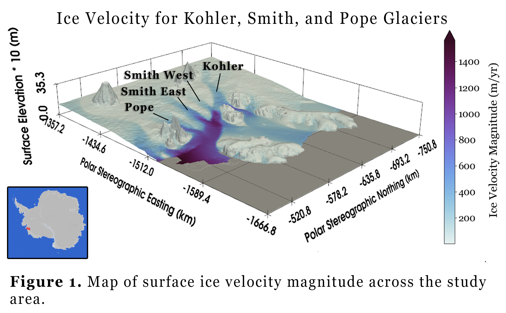
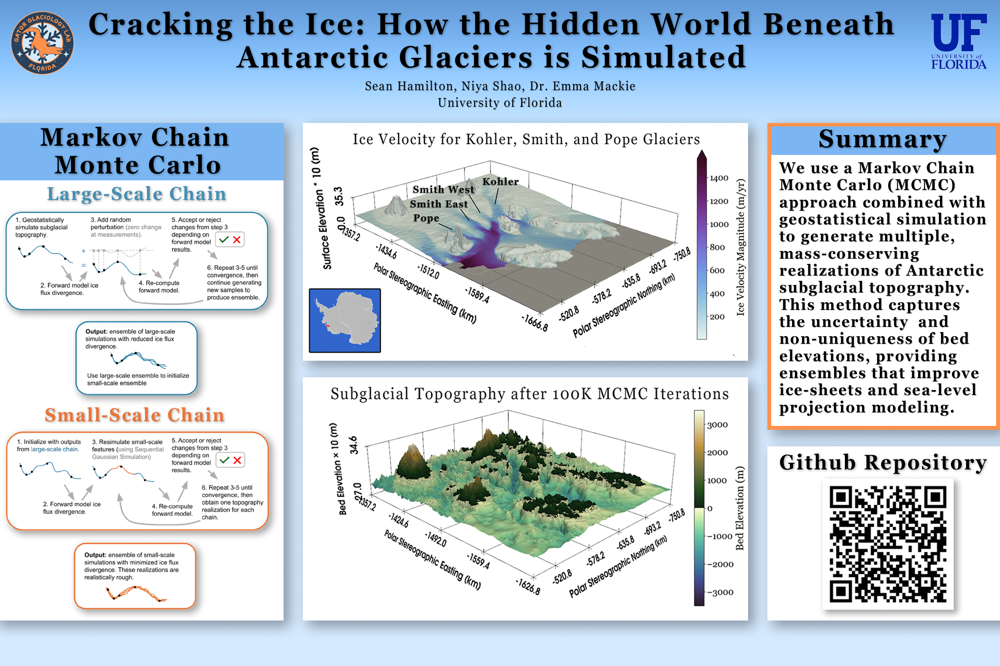

# gly4930-antartic-bed-mapping

## Overview

The [Kohler Glacier](https://en.wikipedia.org/wiki/Kohler_Range), [Pope Glacier](https://en.wikipedia.org/wiki/Pope_Glacier), and [Smith Glaciers](https://www.westarctica.wiki/index.php?title=Smith_Glacier&mobileaction=toggle_view_desktop) are located in the [Amundsen Sea Embayment (ASE)](https://www.britannica.com/place/Amundsen-Sea) located in the [West Antarctic Ice Sheet (WAIS)](https://en.wikipedia.org/wiki/West_Antarctic_Ice_Sheet). Collectively, they are responsible for 32 Gt/yr of ice mass loss over the period 1979–2017 ([Milillo et al., 2019](#milillo2019)). 

Subglacial topography plays a vital role in modeling ice sheets such as these and are used to estimate sea level rise, whose contribution to sea level rise is currently one of the most uncertain ([Wernecke et al., 2021](#wernecke2021)). This is because direct measurements of bed topography remain sparse due to the inability of satellites to penetrate the ice sheets. Rather, radar equipment attached to low-flying planes are used to record these measurements. As a result of these sparse measurements, ice-sheet simulations are required to produce gridded bed maps. This either involves interpolating limited observations or inferring the bed from ice-surface elevation and velocity. These methods usually produce a single, overly smooth estimate that does not represent a physically realistic bed. 

This work implements a new approach that integrates geostatistical simulation with Markov Chain Monte Carlo (MCMC) to generate stochastic realizations of subglacial topography in fast-flowing regions. This is achieved through the use of large-scale and small-scale chains, applied in this case to the Kohler, Pope, and Smith glaciers. The resulting ensemble differs singificantly from BedMachine and can be used in ice-sheet models, enabling topographyic uncertainty to be carried forward into projections of future sea-level change. 

## Usage

To reproduce the results: 

1. Download data from each of the sources and place them in the `data/` folder.

2. Run each of the notebooks in the `geostatisticalMCMC/` folder in order.

## Research Poster

## References

Milillo, S. et al. (2019). *Rapid glacier retreat rates observed in West Antarctica*. NASA Technical Report. https://ntrs.nasa.gov/citations/20230000906

Wernecke, A., Edwards, T. L., Holden, P. B., Edwards, N. R., & Cornford, S. L. (2021). *Quantifying the Impact of Bedrock Topography Uncertainty in Pine Island Glacier Projections for This Century*. Research Letters. https://doi.org/10.1029/2021GL096589

